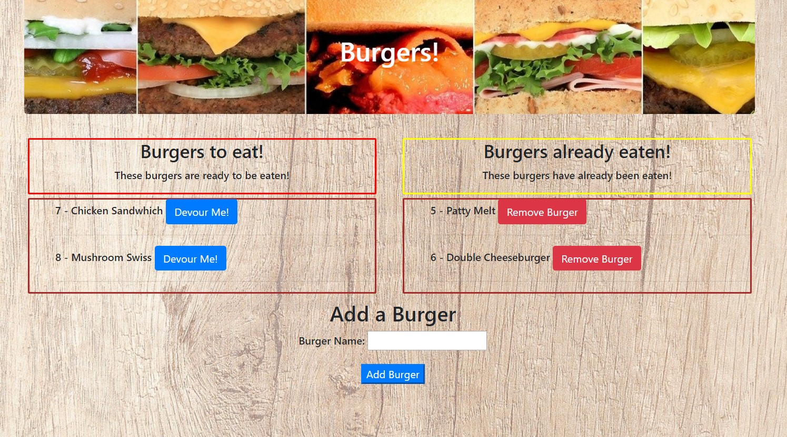
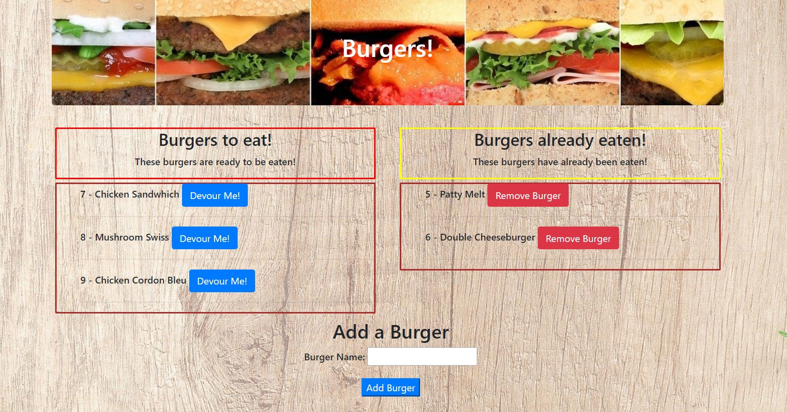
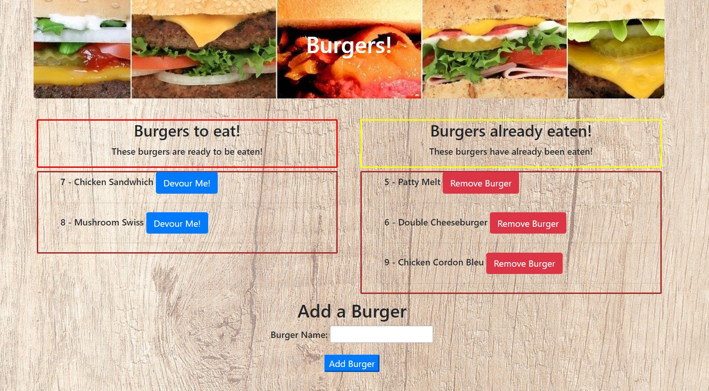
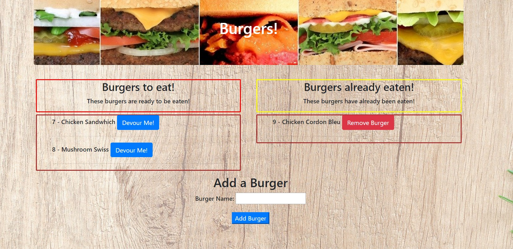

# Burger Order

### Overview

The Burger Order app allows you to order whatever burger you choose and then gives you the ability to devour the burger. After you devour the burger you can then delete that burger from the database.

### Link to the application
https://sleepy-spire-88994.herokuapp.com/

### How it works

You load up the app and there can either be Burgers already listed to be devoured or the list can be empty depending on if all the burgers have been devoured and then thrown away. When you create a new burger, it gets added to the sql database and then added to the burgers to eat column.

Once you add the burgers of your choice you can then click on the button to devour them. Once a burger has been devoured, you can then delete it from the database by clicking on the Remove burger button.

### Tool used

* HTML5
* CSS3
* Javascript
* Bootstrap 4
* Mysql
* Express.js
* Handlebars
* JQuery
* Node.js